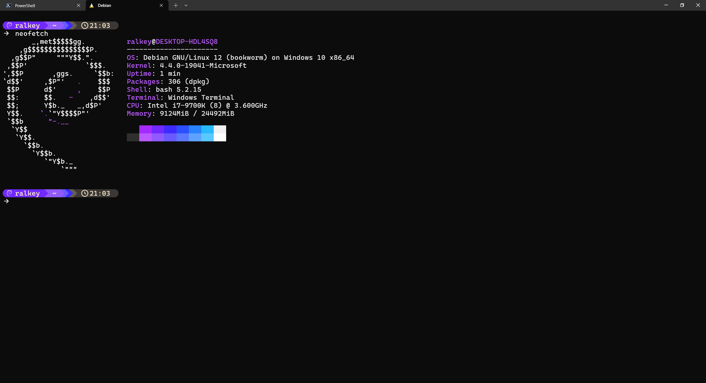

# Terminal setup <!-- omit from toc -->

My current setup for the terminal on Windows.
Along with a installation guide.



---

## Table of contents: <!-- omit from toc -->
- [Step 1: Installing the Right Apps](#step-1-installing-the-right-apps)
  - [Terminal](#terminal)
  - [PowerShell](#powershell)
  - [WSL Debian (Optional)](#wsl-debian-optional)
  - [Starship](#starship)
    - [Windows (With Chocolatey)](#windows-with-chocolatey)
    - [Windows (Without Chocolatey)](#windows-without-chocolatey)
    - [Linux Debian (If WSL is Installed)](#linux-debian-if-wsl-is-installed)
- [Step 2: Installing the Right Font](#step-2-installing-the-right-font)
- [Step 3: Setting Up the Terminal](#step-3-setting-up-the-terminal)
  - [Installing `settings.json`](#installing-settingsjson)
  - [Remove Logo from PowerShell](#remove-logo-from-powershell)
- [Step 4: Setting Up Starship](#step-4-setting-up-starship)
  - [Windows](#windows)
    - [Create Configuration Folder](#create-configuration-folder)
    - [PowerShell](#powershell-1)
    - [Command Prompt](#command-prompt)
  - [Debian](#debian)
    - [Modify `.bashrc`](#modify-bashrc)
    - [Create Starship Configuration](#create-starship-configuration)


---

## Step 1: Installing the Right Apps

### Terminal
To install Windows Terminal, open the Microsoft Store, search for "Windows Terminal", and install it. <br>
Alternatively, you can use [this link](https://www.microsoft.com/store/productId/9N0DX20HK701?ocid=pdpshare).

### PowerShell
To install PowerShell, open the Microsoft Store, search for "PowerShell", and install it. <br>
Alternatively, you can use [this link](https://www.microsoft.com/store/productId/9MZ1SNWT0N5D?ocid=pdpshare).

### WSL Debian (Optional)
⚠*Only recommended if you have Linux experience.*⚠
Open PowerShell as Administrator and run the following command:
```powershell
wsl --install -d Debian
```
Follow the setup steps for Debian.

### Starship

#### Windows (With [Chocolatey](https://chocolatey.org/))
Open CMD as Administrator and run:
```powershell
choco install starship
```

#### Windows (Without [Chocolatey](https://chocolatey.org/))
Download and install the latest MSI installer from their [GitHub releases](https://github.com/starship/starship/releases/latest).

#### Linux Debian (If WSL is Installed)
Open WSL and update the system:
```bash
sudo apt update && sudo apt upgrade
```
Then, install `curl`:
```bash
sudo apt install curl
```
Finally, install Starship:
```bash
curl -sS https://starship.rs/install.sh | sh
```

## Step 2: Installing the Right Font

Visit [nerdfonts.com](https://www.nerdfonts.com/font-downloads) and choose a font you like. <br>
For example, I use [CaskaydiaMono Nerd Font](https://github.com/ryanoasis/nerd-fonts/releases/download/v3.2.1/CascadiaMono.zip).

## Step 3: Setting Up the Terminal

### Installing `settings.json`
1. Open Terminal and navigate to settings (`Ctrl` + `,`).
2. At the bottom-left, click on `Open JSON file`.
3. Delete the existing content and replace it with the settings from [settings.json](terminal/settings.json).
4. Save the file and reopen the Terminal.

Go back to settings, select Profiles, click "Default", and go to "Appearance". <br>
Ensure the Color scheme is set to `Sexy Mama` and the Font is set to `CaskaydiaMono Nerd Font`.

### Remove Logo from PowerShell
In the "PowerShell" profile, add `-nologo` at the end of the Command line. <br>
Make sure to press Save.

## Step 4: Setting Up Starship

### Windows

#### Create Configuration Folder
Press `Windows key` + `R`, type `%userprofile%`, and press Enter. <br>
Create a folder named `.config` in your user directory. <br>
Download the [starship.toml](starship/starship.toml) file to this folder. <br>

#### PowerShell
Open the PowerShell profile in VSCode:
```powershell
code $PROFILE
```
Add the following line at the end of the file:
```powershell
Invoke-Expression (&starship init powershell)
```

#### Command Prompt
1. Install [Clink](https://github.com/chrisant996/clink/releases/latest) from GitHub.
2. Open a `clink\starship.lua` file in VSCode:
```powershell
code %LocalAppData%\clink\starship.lua
```
Add the following line at the end of the file:
```batch
load(io.popen('starship init cmd'):read("*a"))()
```
Save the file.

### Debian

#### Modify `.bashrc`
Open `.bashrc` in NANO:
```bash
nano ~/.bashrc
```
Scroll to the end of the file and add:
```bash
eval "$(starship init bash)"
```
Save the file (`Ctrl` + `S`) and exit NANO (`Ctrl` + `X`).

#### Create Starship Configuration
Open a new file in NANO:
```bash
nano ~/.config/starship.toml
```
Paste the contents from [starship.toml](starship/starship.toml). <br>
Save and close the file as before.
